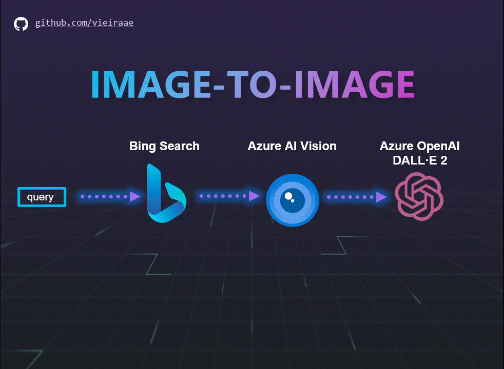

# Sample App with an image-to-image flow using Bing Search 🔍, Azure AI Vision 👁️ and DALL·E 2 🎨 from Azure OpenAI

There are several ways to accomplish the image-to-image pattern. Here I explore the following flow where a caption is extracted from the source image and then the caption is injected into a prompt to generate the target image:

- 🔍 Bing Search retrieves images based on a user query (this step may be replaced with a custom image upload)
- 👁️ Azure AI Vision analyzes the image and detects recognizable attributes
- 🎨 DALL·E 2 from Azure OpenAI generates a new image with a prompt composed by the detected attributes and instructions such as clipart 

## Prerequisites 

* Node.js 8 or later
* A valid subscription key for the Bing Search APIs
* A valid subscription key for the Azure AI Vision APIs
* A valid subscription key for the Azure OpenAI APIs with DALL·E 2 enabled 

## Get started

1. Clone the repository.
2. Navigate to the cloned directory.
3. Install Express.js:
    `npm install`

4. Run the sample app:
    `node app.js`

5. Navigate to the provided URL and have fun doing image-to-image with Bing Search, AI Vision, and DALL·E 2!

## Demo

